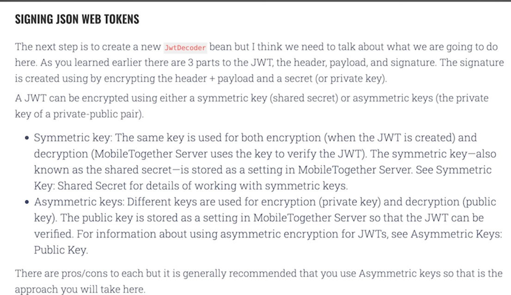

https://www.youtube.com/watch?v=7Q17ubqLfaM

https://wannabedev.io/guides/everything-you-need-to-know-about-json-web-token

to generate public private keys
- generate a pair pf private-public key --> openssl genrsa -out keypair.pem 2048
- obtain public key from private key   --> openssl rsa -in keypair.pem -pubout -out public.pem
- transform pem to pkcs8 format         --> openssl pkcs8 -topk8 -inform PEM  -outform  PEM -nocrypt -in keypair.pem  -out private.pem

These public , private keys are going to be read with spring boot configuration processor

curl -u "titi:password" -XPOST  http://localhost:8080/token -v

get token
curl -H "Authorization: Bearer <Token>" -XGET  http://localhost:8080 -v

